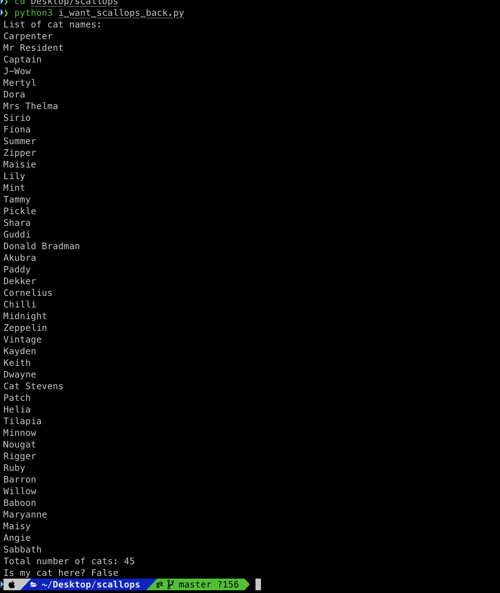
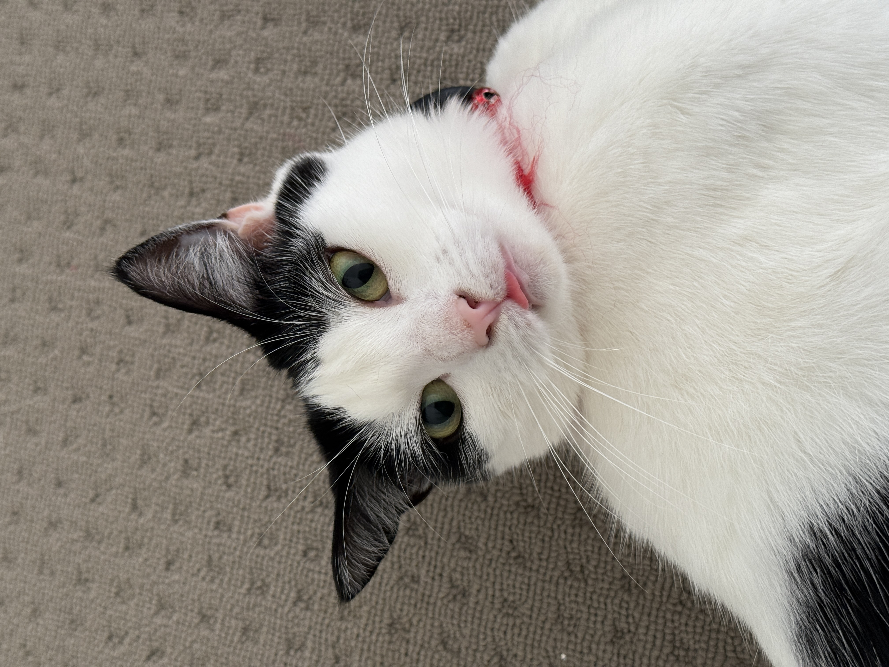

# Web Scraper Script
A little project where I try to teach myself how web scraping works. I had an injured stray cat that I sent to [Animal Welfare Leage NSW](https://www.awlnsw.com.au) for care. I made a script to keep track of the cats they had available for adoption so I can get her once she has healed from her injuries. I ended up getting her and she's in a happy home with me :)

